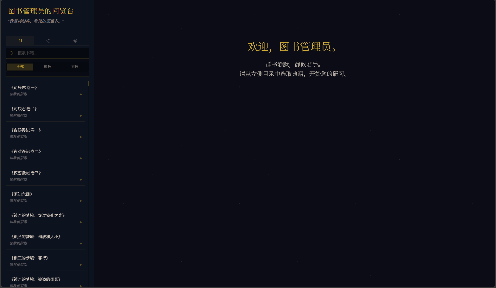
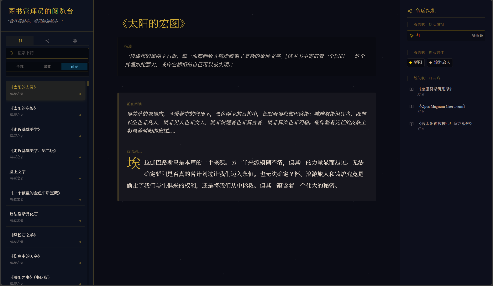
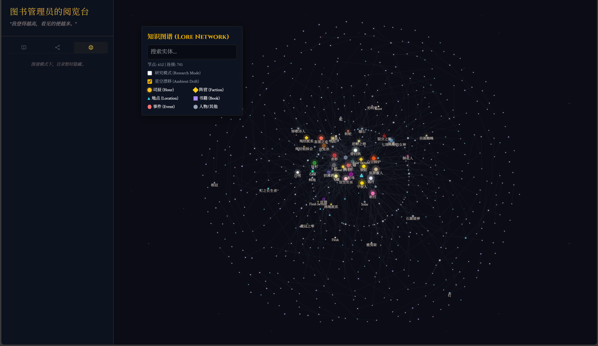
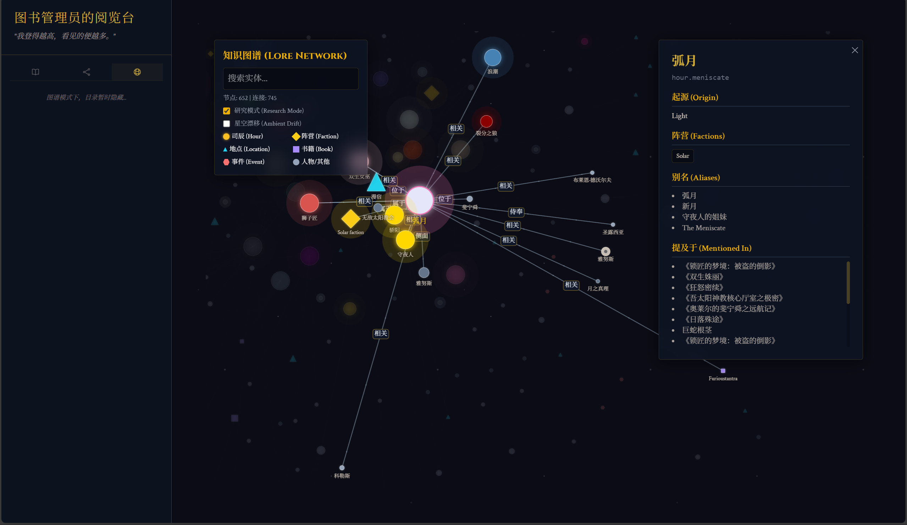
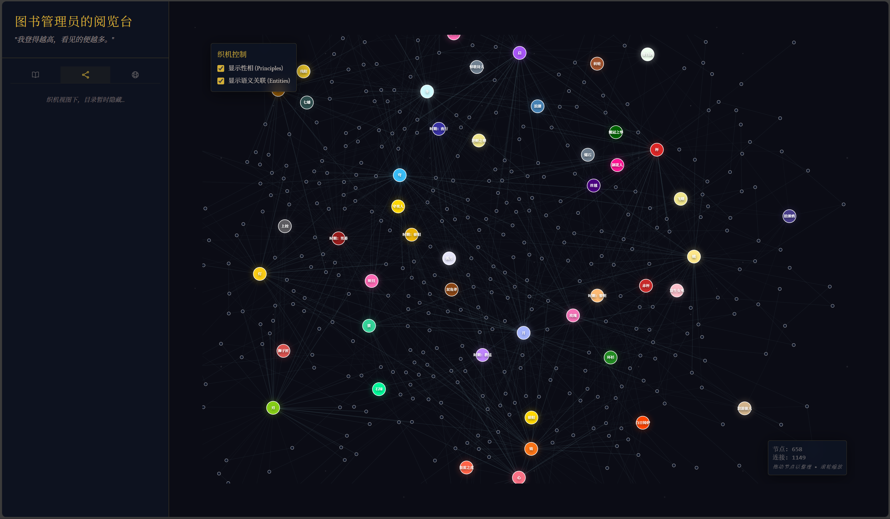
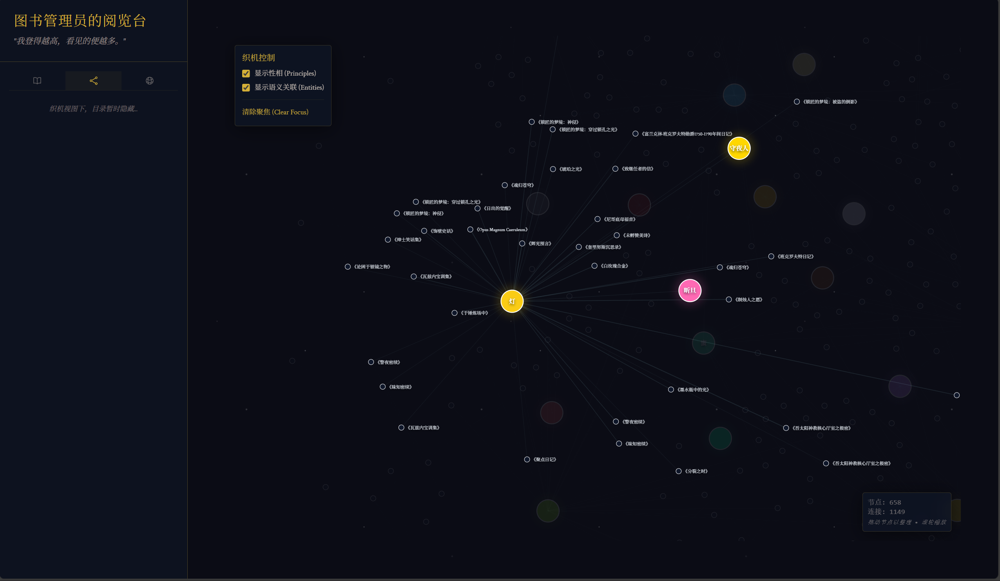

# Hush House / 噤声书屋

**Hush House/噤声书屋 - 《密教模拟器》和《司辰之书》的可视化阅读器**

这是一个基于《密教模拟器 (Cultist Simulator)》和《司辰之书 (Book of Hours)》的世界观的数据可视化与分析项目。

本项目旨在提取游戏中的文本数据，利用大语言模型（LLM，如 DeepSeek）进行深度语义分析，构建一个高质量的实体关系网络（Knowledge Graph），并通过现代化的前端技术提供可交互的在线阅读器和图谱浏览器。

## 👁️ 项目预览

### 🏛️ 噤声书屋首页


### 📖 沉浸式阅读


### 🕸️ 知识图谱与实体关系
展示司辰、具名者与物品之间错综复杂的联系。
| 全局概览 | 聚焦展示 |
| :---: | :---: |
|  |  |

### 🧶 文本织机 (Loom)
基于文本分析的深层关联网络。
| 织机视图 | 细节分析 |
| :---: | :---: |
|  |  |

## ✨ 主要功能

*   **数据提取 (Data Extraction)**: 包含专门的 Python 脚本，用于从游戏源文件中解析和提取结构化数据（书籍、物品、回忆、技能等）。
*   **智能分析 (LLM Integration)**: 利用 DeepSeek 等 LLM 挖掘文本中的深层联系（如隐喻、从属、敌对关系），超越简单的关键词匹配，构建更准确的关系网络。
*   **交互式图谱 (Interactive Graph)**: 基于 React 和 D3.js 构建的力导向图，支持缩放、拖拽和节点筛选，直观展示司辰、具名者、长生者与物品之间的联系。
*   **在线阅览室 (Catalogue)**: 提供可搜索、可过滤的物品与书籍数据库，方便查阅游戏内的详细文本。

## 📂 项目结构

*   **`extractor/`**: Python 数据提取脚本。
    *   `extractor_cs.py`: 《密教模拟器》数据提取。
    *   `extractor_boh.py`: 《司辰之书》数据提取。
    *   `common.py`: 通用工具函数。
*   **`frontend/`**: 前端可视化应用。
    *   基于 Vite + React + TypeScript 构建。
    *   使用 D3.js 和 react-force-graph 进行图谱渲染。
    *   `src/data/`: 存放处理后的 JSON 数据。
*   **`design_docs/`**: 设计文档与开发计划。

## 🚀 快速开始

### 前置要求
*   Node.js (v18+)
*   Python (3.8+)

### 1. 安装依赖

进入前端目录并安装依赖：
```bash
cd frontend
npm install
```

### 2. 启动开发服务器

```bash
npm run dev
```
访问终端输出的本地地址（通常是 `http://localhost:5173/Hush-House/`）即可预览。

### 3. 数据更新（可选）

如果你需要重新提取数据（需要有游戏源文件）：
```bash
cd extractor
# 运行相应的提取脚本
python extractor_boh.py
```

## 🛠️ 技术栈

*   **Frontend**: React, TypeScript, Vite, Tailwind CSS
*   **Visualization**: D3.js, react-force-graph
*   **Data Processing**: Python, Pandas
*   **AI**: DeepSeek LLM (用于关系抽取)

## 📄 版权说明

本项目为非官方的粉丝作品。
《密教模拟器》和《司辰之书》的所有文本、图片及相关资产版权归 **Weather Factory** 所有。
本项目仅用于学习、研究和社区交流。

---
*The Hush House project is a fan-made tool and is not affiliated with Weather Factory.*
